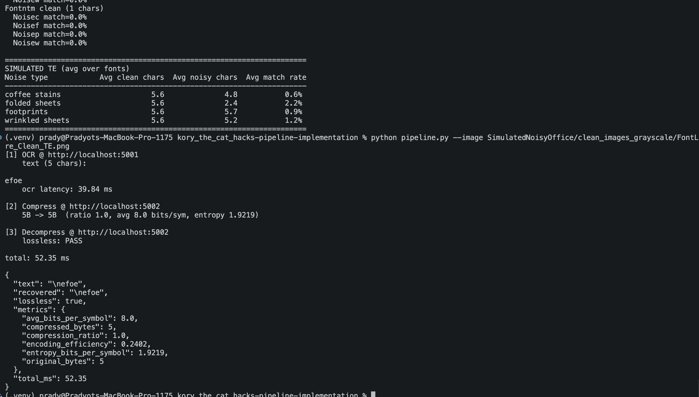

# OCR + Adaptive Huffman

Two microservices and a demo client.

- `ocr_service/` (port 5001): DBNet detector + CRNN/CTC recognizer.
- `compression_service/` (port 5002): adaptive Huffman compress/decompress.
- `pipeline.py`: client that runs image -> text -> compressed -> decompressed.

## Architecture

```
        +---------------+        +--------------------+        +----------------------+
 image  |  OCR service  |  text  | Compression service|  bits  | Compression service  |
 ----->|  :5001         |------>|  :5002 /compress   |------>|  :5002 /decompress   |---> text
        |  DBNet + CRNN |        |  adaptive Huffman  |        |  adaptive Huffman    |
        +---------------+        +--------------------+        +----------------------+
                |                          |                              |
                v                          v                              v
         boxes + lines           ratio, bits/symbol            recovered == original
```

## Setup

```bash
python3 -m venv .venv
source .venv/bin/activate
pip install -r requirements.txt
```

Trained weights ship with the repo at `ocr_service/weights/detector.pt` and
`ocr_service/weights/recognizer.pt`.

## Run

```bash
# terminal 1
cd ocr_service && python server.py

# terminal 2
cd compression_service && python server.py

# terminal 3
python pipeline.py --image path/to/page.png
```

Output: OCR text, compression metrics, `lossless: PASS`.

## Layout

```
ocr_service/
  config.py      charset + sizes
  model.py       DBNet + CRNN
  decode.py      CTC decode
  transforms.py  tensor helpers
  infer.py       detect + recognize
  server.py      Flask /ocr
  weights/       detector.pt, recognizer.pt
compression_service/
  huffman.py     adaptive Huffman
  server.py      Flask /compress, /decompress
pipeline.py      end-to-end client
benchmark.py     OCR sweep over SimulatedNoisyOffice
```

## Benchmark (optional)

With `SimulatedNoisyOffice/` next to the repo, start the OCR server and
run `python benchmark.py`. Prints average character-match rate between
each font's clean TE page and its four noisy variants.


